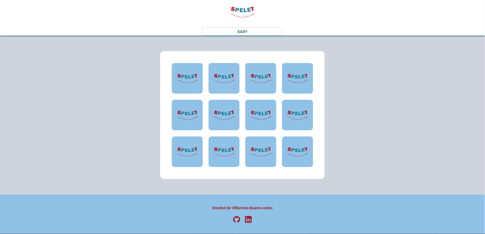

# Spelet



## O que é?

Spelet é um jogo da memória com o tema de programação, desenvolvido com o objetivo de divertir e reforçar o conhecimento adquirido na trilha de aprendizagem do React e Tailwind.

## Acesse o Jogo

Você pode acessar o jogo [aqui](https://memory-game-react-orcin.vercel.app/).

## Funcionalidades

- **Temática de programação**: As cartas do jogo apresentam ícones e conceitos relacionados à programação, tornando-o interessante para desenvolvedores e entusiastas da área.
- **Diferentes níveis de dificuldade**: O jogo pode incluir diferentes níveis de dificuldade, com um número crescente de cartas para memorizar, proporcionando um desafio crescente aos jogadores.
- **Pontuação e tempo**: O jogador pode competir consigo mesmo ou com outros jogadores, tentando completar o jogo com o menor tempo possível e marcando pontos com base na precisão e na velocidade.
- **Design responsivo e visual atraente**: O jogo apresenta um design responsivo e visualmente atraente, tornando a experiência de jogo agradável em diferentes dispositivos.

## Como jogar

1. **Início do jogo**: O jogador inicia o jogo selecionando a dificuldade do jogo.".
2. **Memorização**: O jogador deve memorizar a posição das cartas viradas para baixo.
3. **Virar as cartas**: O jogador pode clicar em duas cartas de cada vez para virá-las e revelar seus ícones.
4. **Correspondência**: Se os ícones das duas cartas forem iguais, elas permanecerão viradas para cima. Se forem diferentes, elas serão viradas novamente após um curto intervalo.
5. **Conclusão do jogo**: O jogo continua até que todas as cartas correspondentes sejam encontradas. O jogador pode verificar sua pontuação e tempo ao final.

## Instalação

Para executar o Spelet localmente, siga estas etapas:

1. Clone o repositório para o seu computador:

```bash
git clone https://github.com/Marcelo-Soares-codes/MemoryGame-React.git
```

3. Instale as dependências do projeto:

```bash
npm install
```

Inicie o servidor de desenvolvimento:

```bash
npm run dev
```

## Contribuição

Contribuições são bem-vindas! Se você deseja melhorar o Spelet, sinta-se à vontade para abrir uma issue ou enviar um pull request.
